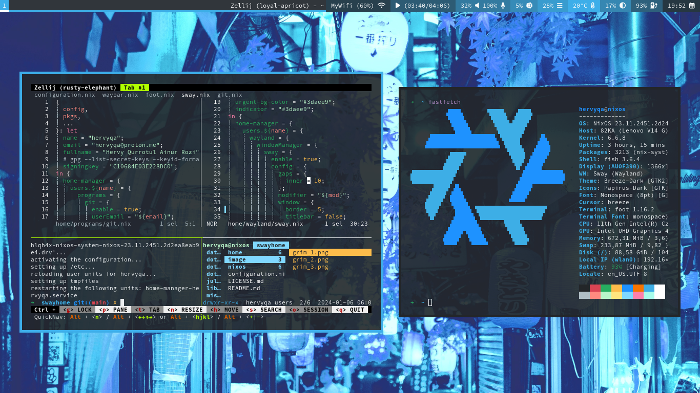
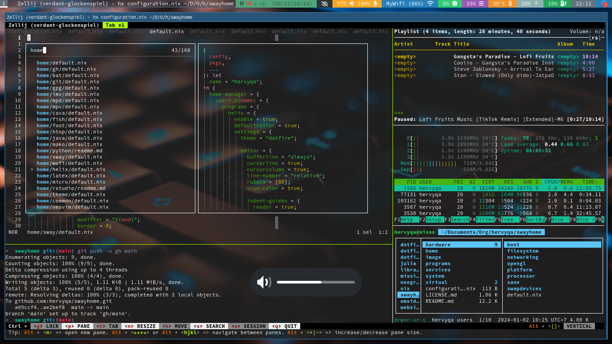

# NixOS + Sway + Home Manager

Configuration of Nixos operating system with Sway DE (disk
encrypted).



Compatible with GTK & QT Themes (breeze-dark) or other themes.



Minimalist Waybar.


## Installation

- Cloning

```sh
git clone git@github.com:hervyqa/swayhome.git
cd swayhome
```

- Configuration

```sh
sudo mv /etc/configuration.nix /etc/configuration.nix.backup
sudo ln -s $PWD/configuration.nix /etc/nixos/
```

- Home manager

I am using stable release version `23.11`, home-manager is also using the same
version. Make sure the system and home-manager also use the same version.

```sh
sudo nix-channel --add https://github.com/nix-community/home-manager/archive/release-23.11.tar.gz home-manager
sudo nix-channel --update
```

If using a different version, please replace `stateVersion` variables from:
* nixos = `nixos/system/system/default.nix`.
* home-manager = `home/default.nix`.

- Change variable

```plain
name = "hervyqa";
fullname = "Hervy Qurrotul Ainur Rozi";
email = "hervyqa@proton.me";
timezone = "Asia/Jakarta";
defaultlocale = "en_US.UTF-8";
extralocale = "id_ID.UTF-8";
layout = "us";
gpgkey = "C10684E03E228DC0";
hostname = "nixos";
version = "23.11";
```

## How to build

This dotfile is installed with the nixos module.
There is no need to run `home-manager switch`
because the system and user configuration are built together.

```sh
sudo nixos-rebuild switch
```

For next build, i prefer using `doas` as an alternative to `sudo`.

```sh
doas nixos-rebuild switch

```

Or using `nrs` from fish abbreviation.
More info: `home/fish/default.nix`

```sh
nrs
```

## License

MIT License

Copyright (c) 2024 Hervy Qurrotul Ainur Rozi
