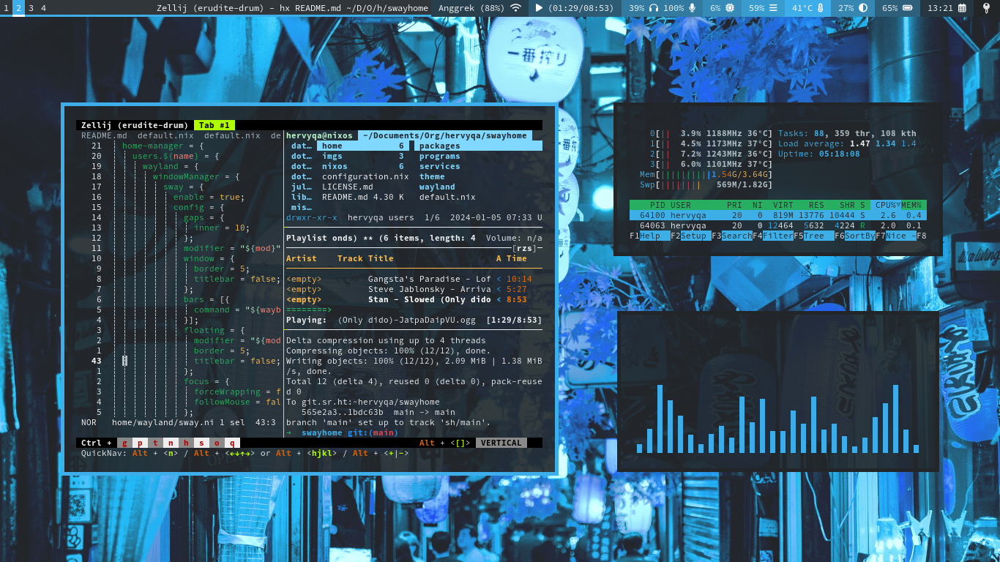

This is the [NixOS](https://nixos.org/) configuration repository for my machines.
Include [Sway WM](https://swaywm.org) and
[Home Manager](https://nix-community.github.io/home-manager/) configuration.

## 🐬 Gallery




Uniform look for Qt and GTK applications (breeze-dark or other themes).


Minimalist Waybar.


## 💠 File structure

- [home](./home): Home-manager configuration.
  - [packages](./home/packages): List of user packages without configuration.
  - [programs](./home/programs): List of user packages with configuration.
  - [services](./home/services): List of user services.
  - [theme](./home/theme): List of user themes (gtk and qt).
  - [wayland](./home/wayland): Window manager configuration (sway).
- [nixos](./nixos): System configuration.
  - [hardware](./nixos/hardware): List of hardware configuration.
  - [programs](./nixos/programs): List of programs installed through the system.
  - [system](./nixos/system): List of system settings.
  - [virtual](./nixos/virtual): Isolation environments and virtual machines.
- [imgs](./imgs): List of screenshot images.

## 💎 List of apps

Category | Name | Description
:--- | :--- | :---
Window manager | `sway` | Tiling wayland compositor.
Bar | `waybar` | Customizable wayland bar for sway.
Terminal session | `zellij` | Terminal workspace with batteries included.
System monitor | `bottom`, `htop` | Graphical process/system monitor.
Audio player | `ncmpcpp`, `mpd` | Ncurses based mpd client.
Browser | `qutebrowser`, `firefox` | Keyboard-focused browser.
File manager | `joshuto`, `pcmanfm` | Ranger-like terminal file manager.
Image viewer | `imv`, `krita` | Command line image viewer.
Menu | `wofi` | Menu/launcher for wayland.
Notification | `mako` | Lightweight wayland notification daemon.
PDF viewer | `zathura` | Highly customizable and functional pdf viewer.
Recorder | `wf-recorder`, `obs-studio` | Screen recording of wlroots-based.
Shell | `fish`, `bash` | Smart and user-friendly command line shell.
Terminal | `foot` | Minimalistic Wayland terminal emulator.
Text editor | `helix`, `neovim`, `micro` | Post-modern modal text editor.
Video player | `mpv` | General-purpose media player.
Backlight | `swayosd`, `light` | Screen display for keyboard shortcuts.
Volume control | `swayosd`, `pamixer` | Screen display for keyboard shortcuts.
Fonts | `monospace:8` | Minimalist monospaced font.
Icons | `papirus-icon` | Pixel perfect icon theme for linux.
GTK & QT Theme | `breeze-dark` | KDE plasma theme.

## 🐳 Sway usage

Keybinding | Optional | Description
:--- | :--- | :---
`Mod` | | Meta key with logo (mod4).
`Mod`+`d` | | Menu or launcher (wofi).
`Mod`+`num` | | Move to workspace (num=1-10).
`Mod`+`h`/`j`/`k`/`l` |  | Focus to window.
`Mod`+`Enter` | | Terminal (foot).
`Mod`+`f` | | Fullscreen window.
`Mod`+`r` | `h`/`j`/`k`/`l` | Resize window.
`Mod`+`b` | `1`/`2` | Browser & private browser (qutebrowser).
`Mod`+`Delete` | `h`/`p`/`r`/`s`/`l`/`o` | Hibernate, poweroff, reboot, suspend, lockscreen & logout.
`Print` | `1`/`2`/`3`/`4` | Printscreen area, all, area (copy) & all (copy).
`Print`+`Shift` | `1`/`2`/`3`/`4`/`0` | Recording area, all, area (no audio), all (no audio) & stop record.

## 🫐 Installation

### Cloning repository

```sh
git clone git@github.com:hervyqa/swayhome.git
cd swayhome
```

### Symlink configuration

```sh
sudo mv /etc/configuration.nix /etc/configuration.nix.backup
sudo ln -s $PWD/configuration.nix /etc/nixos/
```

### Install home manager

I am using stable release version `23.11`, home-manager is also using the same
version. Make sure the system and home-manager also use the same version.

```sh
sudo nix-channel --add https://github.com/nix-community/home-manager/archive/release-23.11.tar.gz home-manager
sudo nix-channel --update
```

If using a different version, please replace `stateVersion` variables from
[nixos](./nixos/system/default.nix) and [home](./home/default.nix).

## 🧢 User variable

Some variables were found in the `.nix` files. You need to replace it with
another name and value. For example:

```nix
...
}: let
  name = "hervyqa";
  fullname = "Hervy Qurrotul Ainur Rozi";
  email = "hervyqa@proton.me";
  timezone = "Asia/Jakarta";
  defaultlocale = "en_US.UTF-8";
  extralocale = "id_ID.UTF-8";
  layout = "us";
  gpgkey = "C10684E03E228DC0";
  hostname = "nixos";
  version = "23.11";
in {
...
```

## 💙 Configure hardware

If you are installing NixOS for the first time, there is a
`hardware-configuration.nix` file, you can change variables and include each
existing module in dotfile settings. You don't need to take all the settings
like these dotfiles, just take the part you need.

### Processor

My machine uses `intel` machine. You can change it if you use another processor
like `amd`.
Nix file: [nixos/hardware/processor.nix](./nixos/hardware/processor.nix).

```nix
hardware = {
  cpu = {
    # amd or intel
    intel = {
      updateMicrocode =
       lib.mkDefault config.hardware.enableRedistributableFirmware;
    };
  };
};
```

### File systems

The disk partition used uses LUKS encryption. You can change the UUID value
currently used.
Nix file: [nixos/hardware/boot.nix](./nixos/hardware/boot.nix).

```nix
boot = {
  initrd = {
    luks.devices = {
      "nixos" = {
        device = "/dev/disk/by-uuid/832b5bb1-889c-407d-972a-db398eab8c59";
      };
    };
  };
```

Change UUID of root (`/`) and efi (`/boot/efi`) partition.
Nix file: [nixos/hardware/filesystem.nix](./nixos/hardware/filesystem.nix).

```nix
fileSystems = {
  "/" = {
    device = "/dev/disk/by-uuid/9395a257-5640-493e-acf9-dcb11761f052";
    fsType = "ext4";
    options = [
      "noatime"
      "nodiratime"
      "discard"
    ];
  };
  "/boot/efi" = {
    device = "/dev/disk/by-uuid/686D-6983";
    fsType = "vfat";
  };
};
```

### Swap partition

If you have a swap linux partition (optional).
Nix file: [nixos/hardware/swapdevices.nix](./nixos/hardware/swapdevices.nix).

```nix
swapDevices = [];
```

## 🗳 How to build

This dotfile is installed with the nixos module.
There is no need to run `home-manager switch`
because the system and user configuration are built together.

```sh
sudo nixos-rebuild switch
```

For next build, i prefer using `doas` as an alternative to `sudo`.

```sh
doas nixos-rebuild switch
```

Or using `nrs` from fish abbreviation.

Nix file: [home/programs/fish.nix](./home/programs/fish.nix).

```sh
nrs
```

## 🌊 Check system

```sh
nix-shell -p nix-info --run 'nix-info -m'
```

Sample output.

- system: `"x86_64-linux"`
- host os: `Linux 6.6.8, NixOS, 23.11 (Tapir), 23.11.2451.2d2ea8eab9e4`
- multi-user?: `yes`
- sandbox: `yes`
- version: `nix-env (Nix) 2.18.1`
- channels(hervyqa): `""`
- channels(root): `"home-manager-23.11.tar.gz, nixos-23.11"`
- nixpkgs: `/nix/var/nix/profiles/per-user/root/channels/nixos`

## 📘 License

[MIT License](./LICENSE.md)

Copyright (c) 2024 [Hervy Qurrotul Ainur Rozi](https://hervyqa.id)
