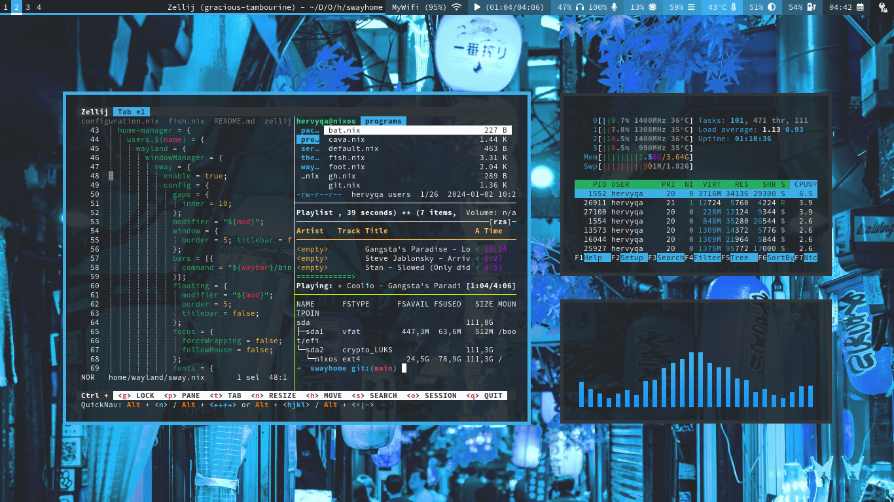
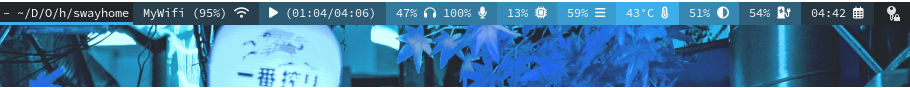

# Swayhome

This is the [NixOS](https://nixos.org/) configuration repository for my machines.
Include [Sway WM](https://swaywm.org) and
[Home Manager](https://nix-community.github.io/home-manager/) configuration.

## 🐬 Gallery




Uniform look for Qt and GTK applications (breeze-dark or other themes).


Minimalist Waybar.



## 💠 File structure

- [home](./home): Home-manager configuration.
  - [packages](./home/packages): List of user packages without configuration.
  - [programs](./home/programs): List of user packages with configuration.
  - [services](./home/services): List of user services.
  - [theme](./home/theme): List of user themes (gtk and qt).
  - [wayland](./home/wayland): Window manager configuration (sway).
  - [xdg](./home/xdg): Manage mimeapps and user-dirs.
- [nixos](./nixos): System configuration.
  - [hardware](./nixos/hardware): List of hardware configuration.
  - [programs](./nixos/programs): List of programs installed through the system.
  - [services](./nixos/services): List of system services.
  - [system](./nixos/system): List of system settings.
  - [virtual](./nixos/virtual): Isolation environments and virtual machines.
- [imgs](./imgs): List of screenshot images.

## 💎 List of apps

|          Category |                  Name |  Alternative |                                             Description |
|              :--- |                  :--- |         :--- |                                                    :--- |
|    Window manager |                `sway` |              |                              Tiling wayland compositor. |
|               Bar |              `waybar` |              |                      Customizable wayland bar for sway. |
|          Terminal |                `foot` |              |                 Minimalistic Wayland terminal emulator. |
|      Audio player |       `ncmpcpp`+`mpd` |              |                               Ncurses based mpd client. |
|         Backlight |               `light` |    `swayosd` |                      Application to control backlights. |
|         Bluetooth | `rofi`+`bluetoothctl` |              |              Interface to connect to bluetooth devices. |
|           Browser |         `qutebrowser` |    `firefox` |                               Keyboard-focused browser. |
|  Display settings |            `wdisplay` |              |             Configuring displays in Wayland compositor. |
|      File manager |             `joshuto` |              |                      Ranger-like terminal file manager. |
|             Fonts |         `monospace:8` |              |                              Minimalist monospace font. |
|    GTK2/3/4 theme |         `breeze-dark` |              |                  GTK Theme built to match KDE's breeze. |
|       QT5/6 theme |       `qt5ct` > `gtk` |              |  QT Theme from GTK theme with qtstyleplugins & qt6gtk2. |
|             Icons |        `papirus-icon` |              |                     Pixel perfect icon theme for linux. |
|      Image viewer |                 `imv` |      `krita` |                              Command line image viewer. |
|     Login manager |              `greetd` |              |  Minimal and flexible login manager daemon (autologin). |
|              Menu |                `rofi` |       `wofi` |      Window switcher, run dialog and dmenu replacement. |
|      Notification |                `mako` |              |                Lightweight wayland notification daemon. |
|    Password store |         `rofi`+`pass` |              | Stores, retrieves, generates, & synchronizes passwords. |
|        Pick color |     `wl-color-picker` |              |        Wayland color picker that also works on wlroots. |
|        PDF viewer |             `zathura` |              |          Highly customizable and functional pdf viewer. |
|       Screen lock |            `swaylock` |              |                              Screen locker for wayland. |
|   Screen recorder |        `wl-screenrec` | `obs-studio` |                      Screen recording of wlroots-based. |
|             Shell |                `fish` |       `bash` |             Smart and user-friendly command line shell. |
|    System monitor |              `bottom` |       `htop` |                       Graphical process/system monitor. |
|  Terminal session |              `zellij` |       `tmux` |             Terminal workspace with batteries included. |
|       Text editor |               `helix` |     `neovim` |                          Post-modern modal text editor. |
|      Video player |                 `mpv` |              |                           General-purpose media player. |
|    Volume control |             `pamixer` | `pulsemixer` |                                     Command line mixer. |

## 🐳 Sway usage

|                                                                 Keybinding |                                                                                Next key |                                                         Description |
|                                                                       :--- |                                                                                    :--- |                                                                :--- |
|                                                             <kbd>Mod</kbd> |                                                                                         |                                          Meta key with logo (mod4). |
|                                         <kbd>Mod</kbd> + <kbd>Number</kbd> |                                                                                         |                                        Move to workspace (num=1-9). |
|                                          <kbd>Mod</kbd> + <kbd>Enter</kbd> |                                                                                         |                                                    Terminal (foot). |
| <kbd>Mod</kbd> + <kbd>h</kbd> / <kbd>j</kbd> / <kbd>k</kbd> / <kbd>l</kbd> |                                                                                         |                                                    Focus to window. |
|                                              <kbd>Mod</kbd> + <kbd>d</kbd> |                                                                                         |                                        Application launcher (rofi). |
|                                              <kbd>Mod</kbd> + <kbd>y</kbd> |                                                                                         |                                          Bluetooth launcher (rofi). |
|                                              <kbd>Mod</kbd> + <kbd>c</kbd> |                                                                                         |                                           Clipboard manager (rofi). |
|                                              <kbd>Mod</kbd> + <kbd>e</kbd> |                                                                                         |                                              Password store (rofi). |
|                                              <kbd>Mod</kbd> + <kbd>n</kbd> |                                                                                         |                                             Pick color for wayland. |
|                                              <kbd>Mod</kbd> + <kbd>f</kbd> |                                                                                         |                                                  Fullscreen window. |
|                                              <kbd>Mod</kbd> + <kbd>q</kbd> |                                                             <kbd>1</kbd> / <kbd>2</kbd> |                            Browser & private browser (qutebrowser). |
|                                              <kbd>Mod</kbd> + <kbd>u</kbd> |                                                             <kbd>i</kbd> / <kbd>o</kbd> |                         Set sink (input) and source (output) audio. |
|                                              <kbd>Mod</kbd> + <kbd>r</kbd> |                               <kbd>h</kbd> / <kbd>j</kbd> / <kbd>k</kbd> / <kbd>l</kbd> |                                                 Resize window apps. |
|                                              <kbd>Mod</kbd> + <kbd>x</kbd> | <kbd>h</kbd> / <kbd>p</kbd> / <kbd>r</kbd> / <kbd>s</kbd> / <kbd>l</kbd> / <kbd>o</kbd> |          Hibernate, poweroff, reboot, suspend, lockscreen & logout. |
|                                              <kbd>Mod</kbd> + <kbd>p</kbd> |                               <kbd>1</kbd> / <kbd>2</kbd> / <kbd>3</kbd> / <kbd>4</kbd> |                    Printscreen area, all, area (copy) & all (copy). |
|                                              <kbd>Mod</kbd> + <kbd>g</kbd> |                <kbd>1</kbd> / <kbd>2</kbd> / <kbd>3</kbd> / <kbd>4</kbd> / <kbd>0</kbd> | Recording area, all, area (no audio), all (no audio) & stop record. |

## 🫐 Installation

### Cloning repository

* Read-only:

```sh
git clone https://git.sr.ht/~hervyqa/swayhome
```

* Read/write (Recommended):

```sh
git clone git@git.sr.ht:~hervyqa/swayhome
```

```sh
cd swayhome
```

### Symlink configuration

```sh
sudo mv /etc/configuration.nix /etc/configuration.nix.backup
sudo ln -s $PWD/configuration.nix /etc/nixos/
```

### Install home manager

I am using stable release version `23.11`, home-manager is also using the same
version. Make sure the system and home-manager also use the same version.

```sh
sudo nix-channel --add https://github.com/nix-community/home-manager/archive/release-23.11.tar.gz home-manager
sudo nix-channel --update
```

If using a different version, please replace `stateVersion` variables from
[nixos](./nixos/system/default.nix) and [home](./home/default.nix).

## 🧢 User variable

Some variables were found in the `.nix` files. You need to replace it with
another name and value. For example:

```nix
...
}: let
  name = "hervyqa";
  fullname = "Hervy Qurrotul Ainur Rozi";
  email = "hervyqa@proton.me";
  timezone = "Asia/Jakarta";
  defaultlocale = "en_US.UTF-8";
  extralocale = "id_ID.UTF-8";
  layout = "us";
  gpgkey = "C10684E03E228DC0";
  hostname = "nixos";
  version = "23.11";
in {
...
```

## 💙 Configure hardware

If you are installing NixOS for the first time, there is a
`hardware-configuration.nix` file, you can change variables and include each
existing module in dotfile settings. You don't need to take all the settings
like these dotfiles, just take the part you need.

### Processor

My machine uses `intel` machine. You can change it if you use another processor
like `amd`.
Nix file: [nixos/hardware/processor.nix](./nixos/hardware/processor.nix).

```nix
hardware = {
  cpu = {
    # amd or intel
    intel = {
      updateMicrocode =
       lib.mkDefault config.hardware.enableRedistributableFirmware;
    };
  };
};
```

### File systems

The disk partition used uses LUKS encryption. You can change the UUID value
currently used.
Nix file: [nixos/hardware/boot.nix](./nixos/hardware/boot.nix).

```nix
boot = {
  initrd = {
    luks.devices = {
      "nixos" = {
        device = "/dev/disk/by-uuid/832b5bb1-889c-407d-972a-db398eab8c59";
      };
    };
  };
```

Change UUID of root (`/`) and efi (`/boot/efi`) partition.
Nix file: [nixos/hardware/filesystem.nix](./nixos/hardware/filesystem.nix).

```nix
fileSystems = {
  "/" = {
    device = "/dev/disk/by-uuid/9395a257-5640-493e-acf9-dcb11761f052";
    fsType = "ext4";
    options = [
      "noatime"
      "nodiratime"
      "discard"
    ];
  };
  "/boot/efi" = {
    device = "/dev/disk/by-uuid/686D-6983";
    fsType = "vfat";
  };
};
```

### Swap partition

If you have a swap linux partition (optional).
Nix file: [nixos/hardware/swapdevices.nix](./nixos/hardware/swapdevices.nix).

```nix
swapDevices = [];
```

## 🗳 How to build

This dotfile is installed with the nixos module.
There is no need to run `home-manager switch`
because the system and user configuration are built together.

```sh
sudo nixos-rebuild switch
```

For next build, i prefer using `doas` as an alternative to `sudo`.

```sh
doas nixos-rebuild switch
```

Or using `nrs` from fish abbreviation.

Nix file: [home/programs/fish.nix](./home/programs/fish.nix).

```sh
nrs
```

## 🌊 Check system

```sh
nix-shell -p nix-info --run 'nix-info -m'
```

Sample output.

- system: `"x86_64-linux"`
- host os: `Linux 6.1.67-rt20, NixOS, 23.11 (Tapir), 23.11.2451.2d2ea8eab9e4`
- multi-user?: `yes`
- sandbox: `yes`
- version: `nix-env (Nix) 2.18.1`
- channels(hervyqa): `""`
- channels(root): `"home-manager-23.11.tar.gz, nixos-23.11"`
- nixpkgs: `/nix/var/nix/profiles/per-user/root/channels/nixos`

## 📘 License

[MIT License](./LICENSE.md)

Copyright (c) 2024 [Hervy Qurrotul Ainur Rozi](https://hervyqa.id)
