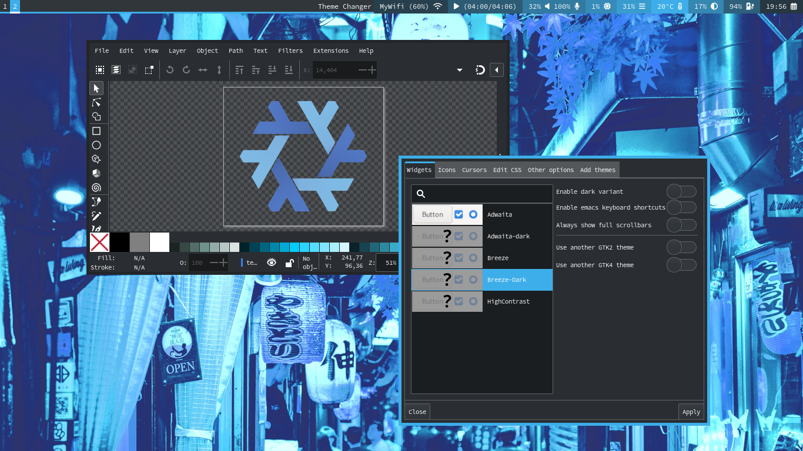

# NixOS + Sway + Home Manager

Configuration of Nixos operating system with Sway DE (disk
encrypted).


Compatible with GTK & QT Themes (breeze-dark) or other themes.



Minimalist Waybar.


## List of apps

Category | Name | Description
:--- | :--- | :---
Window manager | `sway` | i3-compatible tiling wayland compositor.
Bar | `waybar` | customizable wayland bar for sway.
Audio player | `ncmpcpp` `mpd` | ncurses based mpd client.
Browser | `qutebrowser` | keyboard-focused browser.
File manager | `joshuto` `pcmanfm` | ranger-like terminal file manager.
Image viewer | `imv` `qimqv` | command line image viewer.
Menu | `dmenu` | an efficient dynamic menu.
Notification | `mako` | lightweight wayland notification daemon.
PDF viewer | `zathura` | highly customizable and functional pdf viewer.
Shell | `fish` `bash` | smart and user-friendly command line shell.
Terminal | `foot` | minimalistic Wayland terminal emulator.
Text editor | `helix` `neovim` `micro` | A post-modern modal text editor.
Video player | `mpv` | general-purpose media player.
Backlight | `swayosd` `light` | screen display for keyboard shortcuts.
Volume control | `swayosd` `pamixer` | screen display for keyboard shortcuts.
Fonts | `monospace 8` | minimalist monospaced font.
Icons | `papirus-icon` | pixel perfect icon theme for linux.
GTK & QT Theme | `breeze-dark` | kde plasma theme.

## Installation

1. Cloning

```sh
git clone git@github.com:hervyqa/swayhome.git
cd swayhome
```

2. Configuration

```sh
sudo mv /etc/configuration.nix /etc/configuration.nix.backup
sudo ln -s $PWD/configuration.nix /etc/nixos/
```

3. Home manager

I am using stable release version `23.11`, home-manager is also using the same
version. Make sure the system and home-manager also use the same version.

```sh
sudo nix-channel --add https://github.com/nix-community/home-manager/archive/release-23.11.tar.gz home-manager
sudo nix-channel --update
```

If using a different version, please replace `stateVersion` variables from:
* nixos = `nixos/system/system/default.nix`.
* home-manager = `home/default.nix`.

4. Change variable

```plain
name = "hervyqa";
fullname = "Hervy Qurrotul Ainur Rozi";
email = "hervyqa@proton.me";
timezone = "Asia/Jakarta";
defaultlocale = "en_US.UTF-8";
extralocale = "id_ID.UTF-8";
layout = "us";
gpgkey = "C10684E03E228DC0";
hostname = "nixos";
version = "23.11";
```

## How to build

This dotfile is installed with the nixos module.
There is no need to run `home-manager switch`
because the system and user configuration are built together.

```sh
sudo nixos-rebuild switch
```

For next build, i prefer using `doas` as an alternative to `sudo`.

```sh
doas nixos-rebuild switch

```

Or using `nrs` from fish abbreviation.
More info: `home/programs/fish.nix`

```sh
nrs
```

## Check system

```sh
nix-shell -p nix-info --run 'nix-info -m'
```

Sample output.

- system: `"x86_64-linux"`
- host os: `Linux 6.6.8, NixOS, 23.11 (Tapir), 23.11.2451.2d2ea8eab9e4`
- multi-user?: `yes`
- sandbox: `yes`
- version: `nix-env (Nix) 2.18.1`
- channels(hervyqa): `""`
- channels(root): `"home-manager-23.11.tar.gz, nixos-23.11"`
- nixpkgs: `/nix/var/nix/profiles/per-user/root/channels/nixos`

## License

[MIT License](/LICENSE.md)

Copyright (c) 2024 [Hervy Qurrotul Ainur Rozi](https://hervyqa.id)
